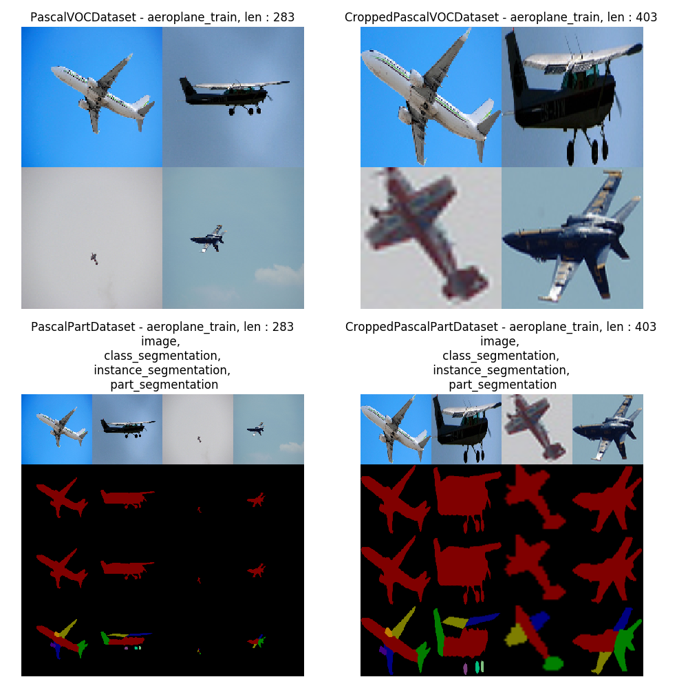

# Python Pascal VOC

* there are several repos on github which already address working with PASCAL VOC (see Related Projects) and PASCAL Parts.
* for some reason, I was not able to find a repo for working with PASCAL VOC and PASCAL Parts jointly.
* In an attempt to change this, I just merged the best repos I was able to find that suit my problem.
* If you find a better way to work with PASCAL, please let me know by creating an issue.
* If you want to have a certain feature implemented, please create an issue.


## Usage


### Installation

```bash
git clone

pip install .
# or
pip install -e . # editable mode, allows changing code on the fly
```


### Setting up the datasets

* Pascal part based on VOC-2010
```bash
cd xxx # the folder you choose
wget http://www.stat.ucla.edu/~xianjie.chen/pascal_part_dataset/trainval.tar.gz
wget http://host.robots.ox.ac.uk/pascal/VOC/voc2010/VOCtrainval_03-May-2010.tar
tar -zxvf trainval.tar.gz
tar -xvf VOCtrainval_03-May-2010.tar

# optional, delte archives
rm VOCtrainval_03-May-2010.tar
rm trainval.tar.gz

# make sure the layout is as follows
- xxx
    - trainval
        - Annotations_Part
        - examples
        some .m files
    - VOCdevkit
        - VOC2010
            - Annotations
            - ImageSets
            - JPEGImages
            - SegmentationClass
            - SegmentationObject
```


* Pascal VOC 2012 (without parts)
```bash
cd xxx # the folder you choose
wget http://host.robots.ox.ac.uk/pascal/VOC/voc2012/VOCtrainval_11-May-2012.tar
wget http://host.robots.ox.ac.uk/pascal/VOC/voc2012/VOCdevkit_18-May-2011.tar
tar -xvf VOCdevkit_18-May-2011.tar
tar -xvf VOCtrainval_11-May-2012.tar

# optional, delte archives


# make sure the layout is as follows
- xxx
    - VOCdevkit
        - VOC2012
            - Annotations
            - ImageSets
            - JPEGImages
            - SegmentationClass
            - SegmentationObject
```


### Instantiating Dataset classes

* see also `test/test_datasets.py`

```python
    # Vanilla PASCAL VOC
    dset = datasets.PascalVOCDataset(
        DIR_VOC_ROOT,
        voc_utils.ANNOTATION_CLASS.aeroplane,
        voc_utils.DATA_SPLIT.train,
    )
    assert len(dset) == 283  # pascal VOC 2010
    example = dset[0] # get training item

    # Iterate over individual box annotations (per category) instead of images
    dset = datasets.CroppedPascalVOCDataset(
        DIR_VOC_ROOT,
        csv_dir,
        voc_utils.ANNOTATION_CLASS.aeroplane,
        voc_utils.DATA_SPLIT.train,
    )
    ex = dset[0]
    assert len(dset) == 403  # pascal VOC 2010

    # Vanilla PASCAL PARTS, iterate over each image
    dset = datasets.PascalPartDataset(
        DIR_VOC_ROOT,
        DIR_ANNOTATIONS_PART,
        voc_utils.ANNOTATION_CLASS.aeroplane,
        voc_utils.DATA_SPLIT.train,
    )
    ex = dset[0]
    assert len(dset) == 283  # pascal VOC 2010

    # Iterate over individual box annotations (per category) instead of images
    dset = datasets.CroppedPascalPartDataset(
        DIR_VOC_ROOT,
        csv_dir,
        DIR_ANNOTATIONS_PART,
        voc_utils.ANNOTATION_CLASS.aeroplane,
        voc_utils.DATA_SPLIT.train,
    )
    ex = dset[0]
    assert len(dset) == 403  # pascal VOC 2010
```


### Working with Pascal Part Annotations

* I found the inferface implemented by [twuilliam/pascal-part-py](https://github.com/twuilliam/pascal-part-py) to be very useful.
* I also added a feature to convert the annotation to RGB more easiliy.


```python
an = ImageAnnotation(image_path, annotation_matrix_path)

an.im  # image

an.objects  # list of objects in the image
an.objects[0].parts  # list of parts that belong to the first object

an.objects[0].mask  # mask of the first object
an.objects[0].parts[0].mask  # mask of the first part of the first object
                             # (see part2ind.py for index encoding)

an.objects[0].props  # properties of the first object (e.g. bbox coordinates, centroid...)
an.objects[0].parts[0].props  # properties of the first part
                              # of the first object (e.g. bbox coordinates, centroid...)

an.cls_mask.as_rgb() # class segmentation
an.inst_mask.as_rgb() # instance segmentation
an.part_mask.as_rgb() # part segmentation
# see scripts/demo.py for usage demo
```


## Running Tests

* the tests require knowledge about the dataset paths, which is provided through environment variables.
* note that you will have to provide all paths, even if you do not want to use the parts dataset, to run the test.

```bash
export DIR_VOC_ROOT="xxx/VOCdevkit/VOC2010"
export DIR_PASCAL_CSV="xxx/pascal_csv" # intermediate csv files for faster data loading will be created here
export DIR_ANNOTATIONS_PART="xxx/trainval/Annotations_Part" # annotations for pascal part


# py.test does not work for some reason 
python -m pytest -s # run all tests

# do not test pascal part. DIR_ANNOTATIONS_PART will thus not be used
python -m pytest -s -m "not pascalpart" 

# Only run pascal part tests. DIR_ANNOTATIONS_PART is thus required
python -m pytest -s -m "pascalpart" 
```

## Running the demo

```bash
# The demos need all paths to be set, otherwise they fail
export DIR_VOC_ROOT="xxx/VOCdevkit/VOC2010"
export DIR_PASCAL_CSV="xxx/pascal_csv" # intermediate csv files for faster data loading will be created here
export DIR_ANNOTATIONS_PART="xxx/trainval/Annotations_Part" # annotations for pascal part


python scripts/demo.py
python scripts/demo.py --i 0 --object-class aeroplane --data-split train --out-path demo.png
```

* demo outputs `demo.png`





## Related Projects

* [pascal-part-classes](https://github.com/tsogkas/pascal-part-classes)

* [twuilliam/pascal-part-py](https://github.com/twuilliam/pascal-part-py)
    * the `pascal_part_annotation.py` and `pascal_part.py` code in this repo is mostly from there.

* [mprat/pascal-voc-python](https://github.com/mprat/pascal-voc-python)
    * the `voc_utils.py` code in this repo is mostly from there.


## TODOs

* the tests are hard-coded to comply with PASCAL VOC 2010, which is the one that works with pascal PARTS